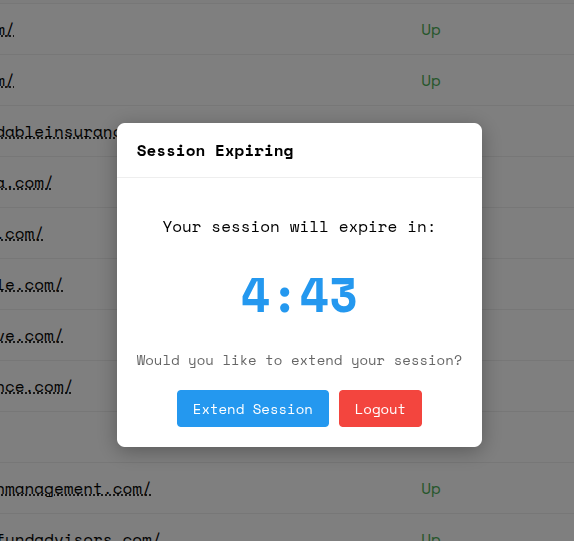
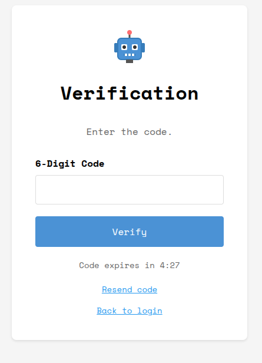
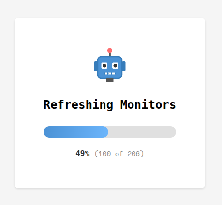
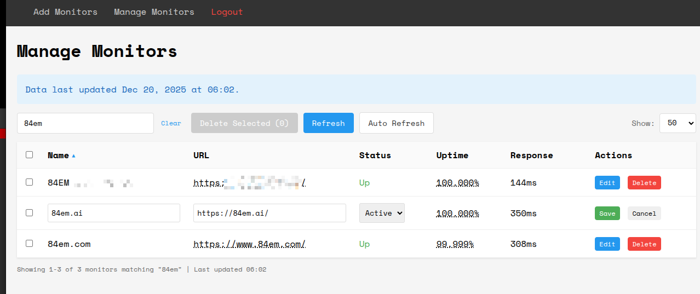
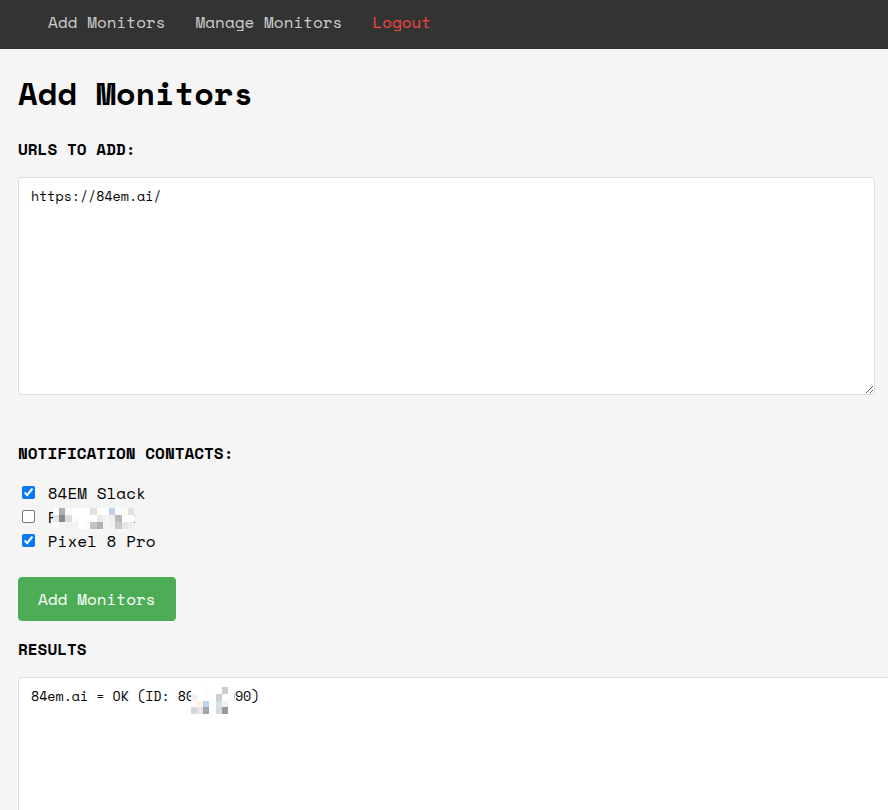

In my [previous post](/posts/claude-code-plan-mode/), I built an MVP for managing UptimeRobot monitors in 7 minutes using Claude Code's Plan Mode. It could pause and delete monitors. Useful, but minimal.

Two days later, it's a proper tool.

## The iteration loop

The beauty of AI-assisted development is how fast you can iterate. Each feature follows the same pattern: describe what you want, review the plan, let Claude implement it, test, repeat.

Here's what got added:

## Authentication

The tool needs to protect access to the UptimeRobot API key. Rather than hardcode credentials or leave it open, I asked Claude to add proper authentication.

The tool now has its own session management with expiry warnings. Extend with one click or logout cleanly. No more leaving authenticated sessions open indefinitely.

## Two-factor authentication

A password alone wasn't enough security for a tool managing 200+ monitors. One prompt later:

Added custom 2FA using TOTP codes, complete with expiry countdown and resend functionality.

## Progress feedback

With 200+ monitors, refreshing the list takes time. Staring at a frozen screen is bad UX.

Added a progress indicator that shows exactly where you are in the refresh cycle.

## Enhanced monitor management

The manage screen evolved from basic to fully-featured:

- Inline editing with save/cancel
- Search filtering
- Status dropdown (Active/Paused)
- Sortable columns
- Auto-refresh toggle
- Bulk delete selection

Each feature was a separate conversation with Claude. "Add inline editing." "Add search." "Add auto-refresh." Small, focused iterations.

## Notification contacts

The add monitors screen now lets you select which notification contacts to attach:

Pick from your configured contacts. See results immediately.

## What's next

The [UptimeRobot API](https://uptimerobot.com/api/legacy/#methods) has more to offer. Current implementation covers the core monitor operations:

- getMonitors, newMonitor, editMonitor, deleteMonitor
- getAlertContacts (read-only, for attaching to monitors)

Still on the roadmap:

- **Monitor reset** - Clear downtime history for a monitor
- **Alert contact management** - Create, edit, and delete notification contacts directly
- **Maintenance windows** - Schedule planned downtime periods so alerts don't fire during deployments
- **Public status pages** - Manage status pages that show uptime to customers

Each of these is another conversation with Claude. The pattern stays the same: describe the feature, review the plan, implement, test. The API endpoints exist. The UI patterns are established. Adding features is now just a matter of deciding which ones are worth the time.

## The takeaway

The MVP took 7 minutes. The production version took maybe 2 hours spread across two days. Most of that time was testing and deciding what features to add next.

AI doesn't replace the thinking. You still need to know what you want. But the gap between "I want this" and "I have this" has collapsed. Features that would have taken an afternoon now take minutes.

That changes how you build. You can afford to experiment. Try something, see if it works, throw it away if it doesn't. The cost of iteration approaches zero.
